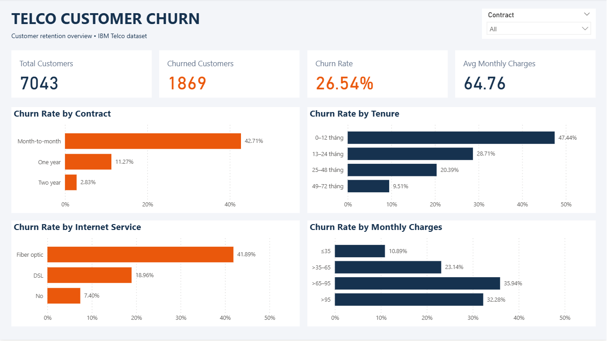
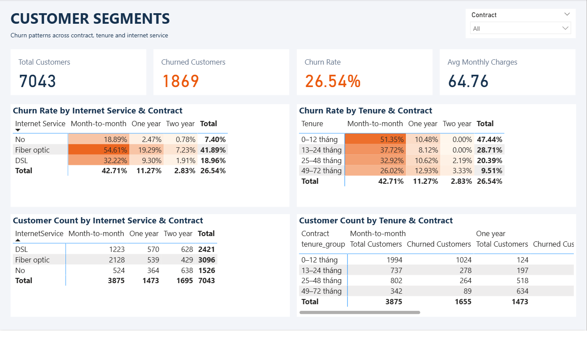

## Key Findings

- Overall churn rate is **26.54%**: 1,869 of 7,043 customers left.
- Month-to-month customers have a **42.71%** churn rate, compared with **11.27%** for one-year and **2.83%** for two-year contracts.
- Customers with 0–12 months of tenure have a **47.44%** churn rate, compared with **9.51%** for those with 49–72 months.
- Fiber optic customers on month-to-month contracts have a **54.61%** churn rate across **2,128 customers**.
- Among month-to-month customers, churn decreases from **51.35%** in the 0–12 month tenure group to **26.02%** in the 49–72 month group.

## Recommendations

- Test retention offers for fiber optic customers on month-to-month contracts.
- Strengthen onboarding and customer support during the first year.
- Test incentives for switching to longer contracts and measure their effect on retention and profitability.
- Investigate service experience and pricing concerns through customer feedback.

These findings describe associations in the dataset and do not establish causation.

## Dashboard

### Churn Overview

### Customer Segments
